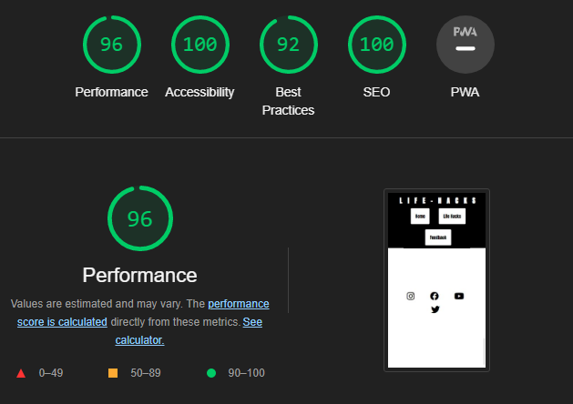

<h1 align="center">Life-Hacks</h1>

## Introduction

This webpage is a simple webpage displaying some lifehacks that a programmer could use to be more efficient. This webpage is responsive so users can view it on a laptop, tablet and mobile devices.

## Accessibility

Added ARIA attribute to all links on HTML pages. This helps people with disabilities understand what a link is and its purpose.

I used the semantic HTML markup  to help the browser understand the context of the content and also help accessibility for users with disabilities.

I’ve used `role` and `alt` Attributes on all the background images or images used to explain what the images are.

## Accessibility Score: Google Lighthouse Test

The site ran through Google Lighthouse for Desktop and Mobile:

### Desktop Scores:

### Mobile Scores:

## SEO (Search Engine Optimisation)

I've added `meta data` and a `title` to the .html pages. This helps Search engines like Google when looking for matches based on what the user searches for. 

I added a `description`, `keywords` and `author`. Search Engines will display the title and description information in their search results.

## Features List

### 1. Hover State on Buttons

The navigation buttons on the site have a hover site which clearly shows that the button is interactable.

## 2. A contact us page

Contact us page allows encourages users to get in touch to see if they have any feedback or any suggestions to help the page

Users could report bugs they find within the page so it could fixed for better user expierience

## 3. social media icons

This is usefull because if the user wants to follow any social media acounts by the author or the webpages social medias accoutn for updates and news

## Responsive Testing

I have tested that the site is responsive by applying specific styles for different `CSS breakpoints`

#### Breakpoint used for mobile devices:

`max-width: 800px` 

I used the Chrome inspect element to check the different CSS breakpoints.

### Contact-us Submission

I've tested the validation on the booking form so the user cannot submit the form unless all fields have been filled out. The prevents missing information that is needed to make the booking.

### Form Validation

I've tested the validation on the booking form so the user cannot submit the form unless all fields have been filled out. The prevents missing information that is needed to make the booking.

### Bugs encountered during testing

1. first bug was actually loading times the site took, this is because of the images being large in size so the webpage was forcing it to become smaller and fit within the page which took a little amount of time. I immediatly had to fix this becuase it would not be a good expierence for the user if the webpage was slow so what i did was use Photoshop to resize images into sizes that would fit and be quicker to load.

2. second bug I encountered was the Main image in the home page overflowing out of its section, to fix this I had to add ` overflow: hidden `

3. another bug i faced was using variabled to store colors and when those colors would not work in anchor tag elements they needed to be fixed, so i got rid off the variables

## HTML and CSS Code Validation

## Deployment

The site was published via Github Pages. You can see the site live 
<a href="https://ib-1.github.io/Project-1-Ci/" target="_blank">here</a>.

## Credit

<li>Used code from love running project for the animation zoom</li>
<li>Title image and feedback background image were taken from pexels</li>
<li>Used code support website such as Stack overflow and W3school to help code my project</li>
